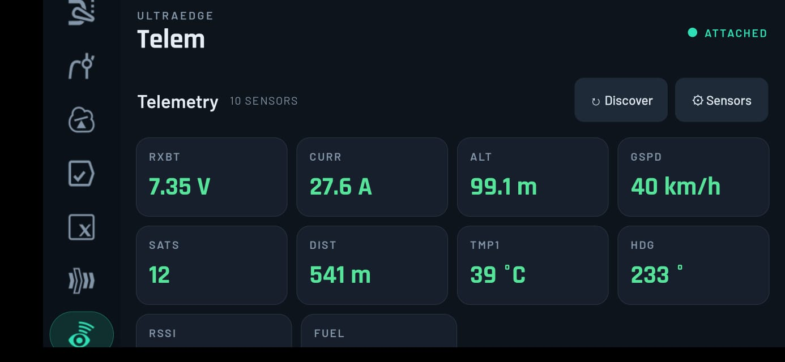
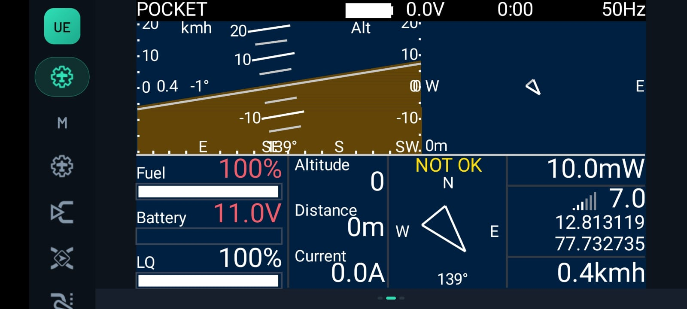

# UltraEdge

**Your Android phone as the big touchscreen for an EdgeTX radio — over a USB cable, without ever
touching the flight-control path.**

UltraEdge turns your phone into a rich companion display and editor for an [EdgeTX](https://edgetx.org)
radio that only has a small mono screen and a few buttons. Plug the phone into the radio's USB port and
it renders the model config, mixers, inputs, telemetry, channel monitors, screens and audio on a modern
touchscreen. **The radio stays a fully standalone EdgeTX transmitter the whole time** — unplug the phone
and nothing about how it flies changes.

> This repository is the app's **public home**: user manual, privacy policy, changelog, and issue
> tracker. The app is distributed **only through Google Play** — there are no APK downloads here, and the
> app source is not published.

## Features
- Live dashboard — trims, sticks, timers, battery, RSSI, flight mode, and telemetry/OSD screens
- Full model editing — inputs, mixes, outputs, curves, logical switches, special functions, GVars,
  flight modes, telemetry sensors
- Radio settings — backlight, sticks, units, time, hardware, switch names
- Guided, graphical **stick/pot calibration**
- Live telemetry + sensor **Discover**
- **Flight logs** — pull `.csv` logs off the radio to your phone, share them *(cloud backup & 3D replay
  coming soon)*
- Model + radio-settings **backup**, SD-card content, sounds and tools

## Supported radios
Any EdgeTX radio running the UltraEdge companion firmware. Verified: **FrSky QX7** and **RadioMaster
Pocket**. Build/flash the firmware from the EdgeTX-UE project (below).

## Get it
1. Install from **[Google Play](https://play.google.com/store/apps/details?id=com.ultraedge.companion)**
   (Android 7.0+, a phone with USB host/OTG).
2. Flash the UltraEdge companion firmware to your radio — see **[EdgeTX-UE](https://github.com/50UR4V/edgetx-ue)**.
3. Plug in over USB and tap **Open UltraEdge**. Full guide: **[User Manual](USER-MANUAL.md)**.

## Screenshots
<table>
  <tr>
    <td width="50%"> Home dashboard on a RadioMaster radio — live RSSI, battery, timer.</td>
    <td width="50%"> Phone mounted on a Pocket — a Lua telemetry screen on the big display.</td>
  </tr>
  <tr>
    <td width="50%"> Live telemetry — discover and view all your sensors.</td>
    <td width="50%"> Your radio's telemetry/OSD screens, rendered on the phone.</td>
  </tr>
</table>

## The UltraEdge ecosystem
- **[UE Protocol](https://github.com/50UR4V/ue-protocol)** — the open radio↔phone protocol UltraEdge
  speaks (spec + reference codec + tests). Anyone can implement it.
- **[EdgeTX-UE](https://github.com/50UR4V/edgetx-ue)** — the EdgeTX companion firmware, offered upstream.
- **[UltraEdge Mounts](https://github.com/50UR4V/ultraedge-mounts)** — community 3D-printable mounts to
  hold the phone on your radio.

## Privacy & licenses
UltraEdge collects **no personal data** and talks only to your radio over USB. See the
**[Privacy Policy](PRIVACY.md)** and **[Open-Source Notices](OPEN-SOURCE-NOTICES.md)** (it embeds
unmodified MIT-licensed Lua; the companion firmware is GPL-3.0). The app itself is proprietary.

## Become a beta tester
UltraEdge is in closed testing on Google Play. Want early access and to help shape it?
**[📧 Request to be a beta tester](mailto:50ur4v.x@gmail.com?subject=UltraEdge%20beta%20tester&body=Hi%2C%20I%27d%20like%20to%20join%20the%20UltraEdge%20beta.%20My%20radio%3A%20____%20%28e.g.%20QX7%2FPocket%29.%20My%20Google%20account%20email%20for%20Play%20access%3A%20____)**
— tell me your radio and the Google account email you use on Google Play, and I'll add you to the test track.

## Support
Found a bug or have a request? **[Open an issue](https://github.com/50UR4V/UltraEdge-app/issues)** —
include the diagnostics log (in-app: Radio Settings ▸ Diagnostics ▸ Share log).

---
*UltraEdge is an independent community project and is not affiliated with or endorsed by EdgeTX or FrSky.
EdgeTX and FrSky are trademarks of their respective owners.*
